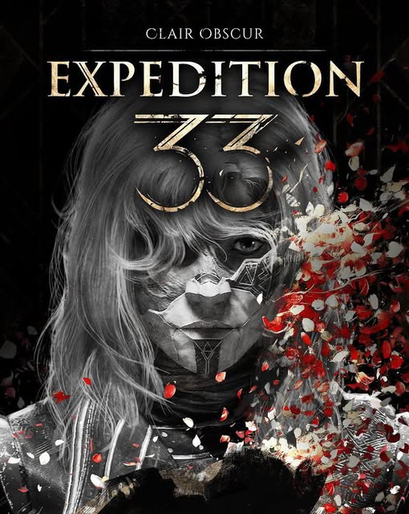

# Alicia (Clair Obscur: Expedition 33)

  

A standard code theme for Visual Studio Code inspired by the aesthetics of **Alici** from _Clair Obscur: Expedition 33_. It features a dark background.

## Installation

### Option 1: Visual Studio Code Marketplace (Recommended)

1. Open **Visual Studio Code**.
2. Go to the **Extensions** view (`Ctrl+Shift+X` or `Cmd+Shift+X`).
3. Search for `Alicia Expedition 33 Theme`.
4. Click **Install**.
5. Once installed, select the theme from **File > Preferences > Color Theme** > `Alicia Expedition 33 Theme`.

  

## License

MIT License - JaviMGG